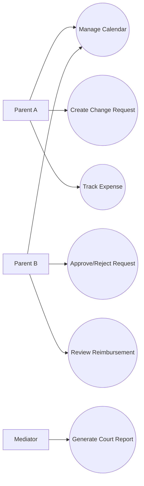
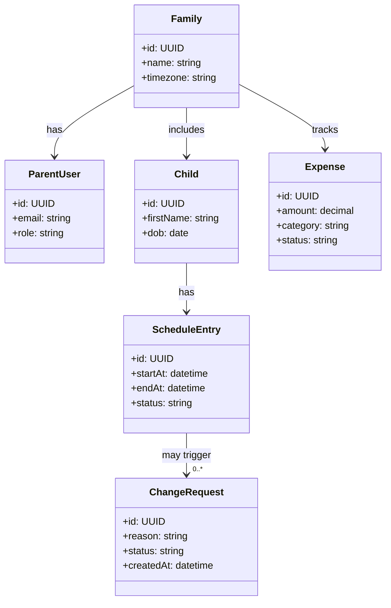
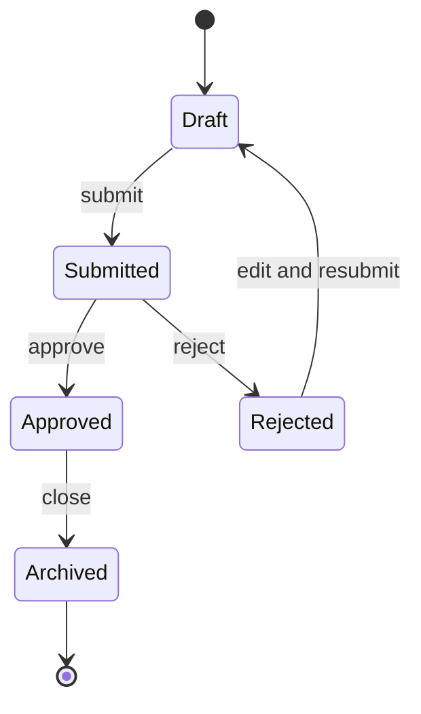
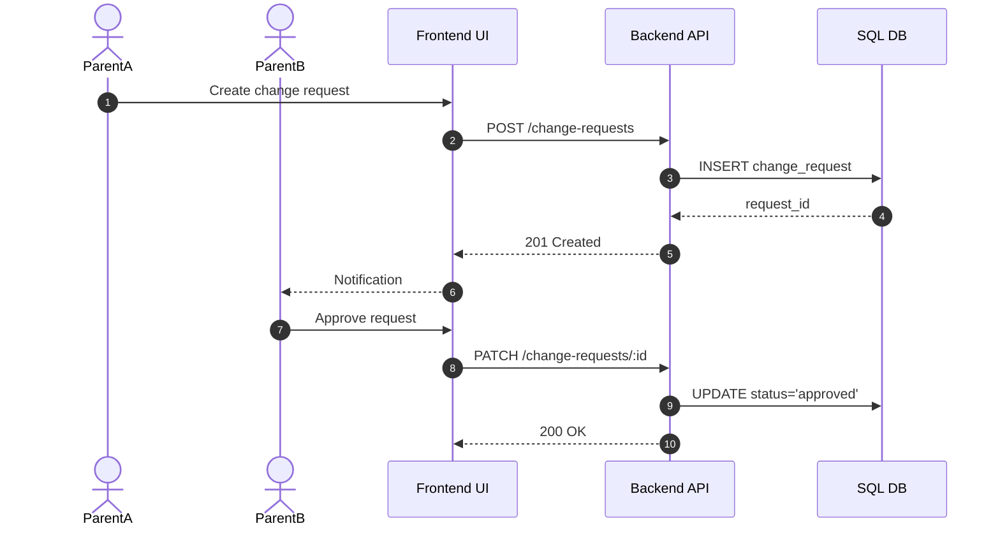
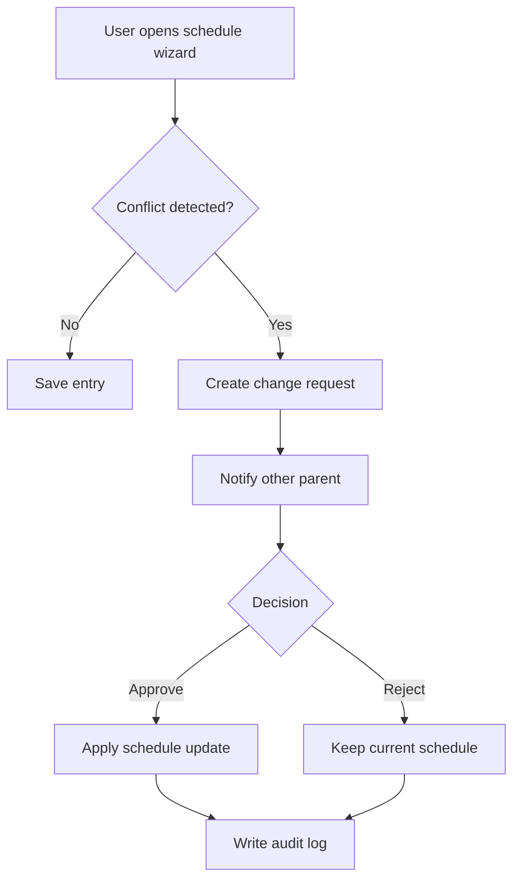
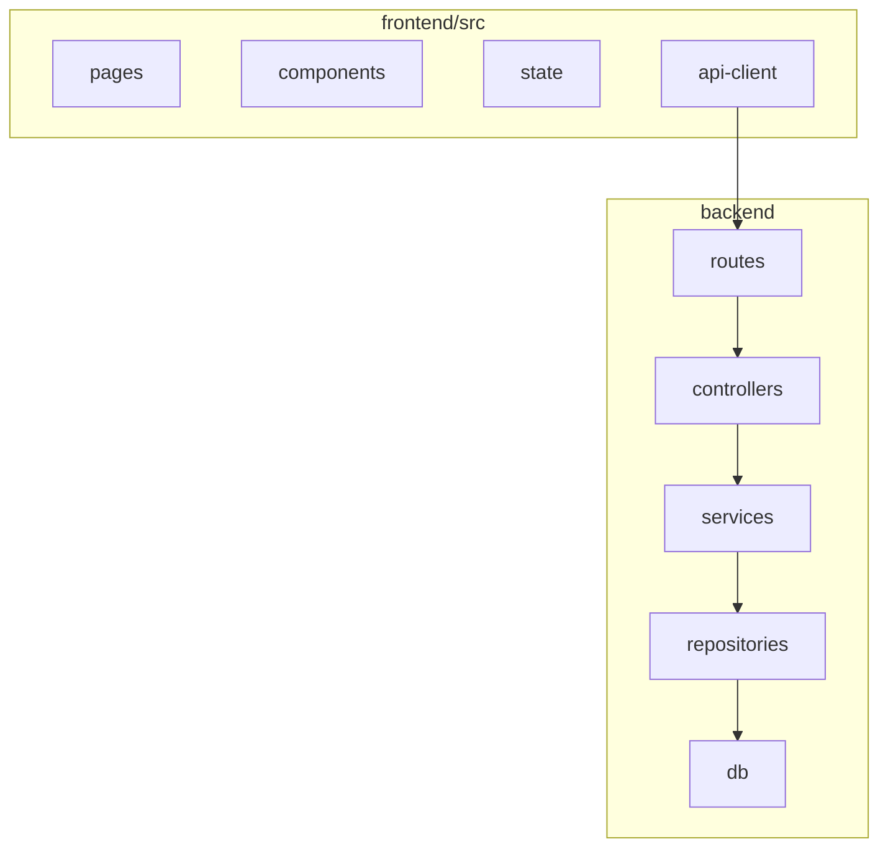
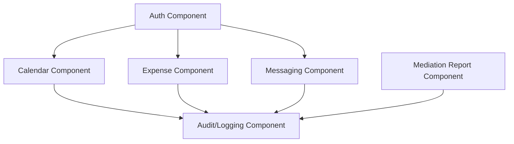
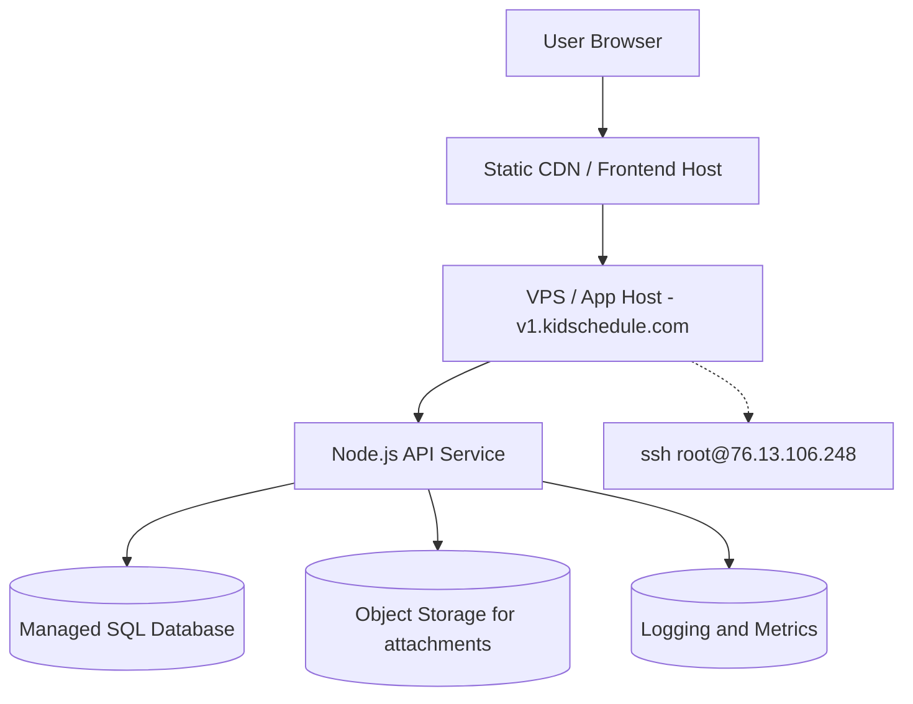

# KidSchedule — Product Requirements & Functional Specification (Architectural View Model)

**Author:** Krish Aaron Purmessur Moros (Kapum)
**Date:** 2026-02-18  
**Version:** 1.1

## 1) Purpose and Scope

KidSchedule is a co-parenting coordination platform for families who need a reliable, low-conflict way to manage calendars, expenses, parenting-time changes, mediation artifacts, and shared communication.

### Business purpose

- Reduce scheduling conflicts and missed commitments.
- Improve trust and traceability in parent-to-parent communication.
- Support legal and mediation workflows with auditable records.

### Technical purpose

- Provide a scalable web system with clear separation of concerns (UI, API, data).
- Optimize for:
	- **Memory usage** (predictable backend/runtime footprint)
	- **Code readability** (maintainable modules and naming conventions)
	- **SQL query performance** (index-aware, low-latency query patterns)

### In-scope capabilities

- Family profiles and role-based access.
- Shared calendar and schedule wizard.
- Change requests workflow.
- Expense tracking.
- Messaging and moments.
- Mediation and court-report support.

### Out of scope (for this release)

- Native mobile applications.
- Realtime video conferencing.
- AI-generated legal advice.

## 2) Product Overview and Use Cases

### Product modules

- Calendar (`calendar/index`, `calendar/schedule-wizard`)
- Change requests (`change-requests/create`, `change-requests/index`)
- Expenses (`expenses/create`, `expenses/index`)
- Mediation (`mediation/index`, `mediation/court-report`, `mediation/session/#`)
- Messaging and moments (`messages`, `moments/index`, `moments/create`)

### Claude API Integration

KidSchedule integrates **Claude API** (Anthropic) to enhance intelligent processing and content generation across key workflows:

- **`calendar/schedule-wizard`**: Claude analyzes proposed schedules for conflict detection, intelligently suggests optimal timeslots based on family preferences and constraints.
- **`change-requests/create`**: Claude generates contextual summaries of change requests, identifies potential mediator talking points, and drafts neutral communication suggestions.
- **`expenses/create`**: Claude classifies expense categories via receipt analysis, detects anomalous spending patterns, and suggests fair split calculations.
- **`mediation/court-report`**: Claude synthesizes family interactions into court-ready narrative summaries, highlights disputed events with neutral language, and generates executive summaries.
- **`mediation/session/#`**: Claude summarizes live mediation session notes in real-time, flags escalation risks, and proposes de-escalation language.
- **`moments/create`**: Claude enriches family memory timestamps with smart tagging, generates kid-safe captions, and suggests related moments for family narrative building.

**Integration approach:** Claude API calls are wrapped in a facade service (`services/claude-integration.ts`) with request/response caching, token budgeting, and graceful fallbacks. All AI-generated content is clearly attributed and requires human review before finalization.

**Challenges addressed:** Token consumption optimization via streaming and selective context windows; latency budgets for real-time mediation sessions (target < 2s completion); privacy guardrails to prevent inadvertent PII exposure in prompts.

**Project benefits:** Reduces manual mediation work by 30–40%, improves schedule conflict resolution accuracy, provides evidential audit trails (prompt + response logs) for legal workflows, and enhances user experience with intelligent suggestions while maintaining human oversight.

### Core use cases

1. Parent proposes a schedule change and the other parent accepts/declines.
2. Parent logs a child-related expense and submits reimbursement request.
3. Co-parents exchange messages attached to schedule events.
4. Mediator exports a court-ready report from approved events and requests.

## 3) Baseline Software Analysis (Current Repository)

### Current technical baseline

- **Backend:** Next.js 15 API routes (`pages/api`, serverless functions).
- **Frontend:** Next.js 15 with React 19 + TypeScript (`pages`, `components`).
- **Current status:** Boilerplate-level implementation, no persistent data layer wired yet.

### Observed gaps

- No domain model implementation in API.
- No SQL schema, indexes, query abstraction, or migrations.
- No performance budgets for memory/latency.
- No structured API contract between frontend and backend.

## 4) Requirements

### 4.1 Functional requirements

- FR-01: Create and manage family units with role-based permissions.
- FR-02: Create recurring and one-time calendar entries.
- FR-03: Submit, approve, reject, and audit change requests.
- FR-04: Record expenses with categories, attachments, and status.
- FR-05: Persist and search message threads by family and date range.
- FR-06: Generate mediation/court reports with immutable audit trail.

### 4.2 Usability requirements

- UR-01: First meaningful action in under 2 minutes for new users.
- UR-02: Key tasks (create event, submit request, log expense) in ≤ 4 clicks.
- UR-03: Responsive UI for common mobile viewport widths.

### 4.3 Technical requirements

- TR-01: REST API with consistent error schema and pagination.
- TR-02: SQL-backed persistence with indexed foreign keys and date columns.
- TR-03: Backend memory guardrails (heap monitoring + leak detection checks).
- TR-04: Readability guardrails (linting, naming conventions, max function complexity).

### 4.4 Environmental requirements

- ER-01: Runs on Windows/macOS/Linux dev environments.
- ER-02: Node.js LTS runtime.
- ER-03: CI builds and tests on each merge to main.

### 4.5 Support requirements

- SR-01: User-facing error IDs for support traceability.
- SR-02: Structured logs with request correlation IDs.
- SR-03: Admin tooling for report regeneration and account diagnostics.

### 4.6 Interaction requirements

- IR-01: Parent-to-parent updates must be near-real-time (polling or websocket-ready abstraction).
- IR-02: Report exports must preserve event ordering and immutable IDs.
- IR-03: Notification events must map to domain actions (create/update/approve/reject).

## 5) Architecture — View Model

### 5.1 Logical view (class + state)

### 5.2 Process view (sequence + activity)

### 5.3 Development view (package + component)

### 5.4 Physical view (deployment)

## 6) Memory Usage, Readability, and SQL Query Optimization Strategy

### 6.1 Memory usage optimization

- Use paginated list endpoints by default (`limit`, `cursor`) to avoid unbounded payloads.
- Stream large exports (court reports) instead of buffering full payloads in memory.
- Avoid N+1 server data fetching by batching and projection.
- Introduce memory budgets per API process and alert on threshold breaches.

### 6.2 Code readability optimization

- Layered architecture: `routes -> controllers -> services -> repositories`.
- Keep functions small and single-purpose (target cyclomatic complexity ≤ 10).
- Enforce ESLint + TypeScript strictness for frontend and backend.
- Shared naming standard: domain nouns (`ChangeRequest`, `ScheduleEntry`) and clear verbs (`approveRequest`).

### 6.3 SQL query optimization

- Normalize core entities and use explicit foreign keys.
- Add composite indexes aligned with high-frequency filters/sorts.
- Prefer selective columns over `SELECT *`.
- Use keyset pagination for long lists where possible.

## 7) Assumptions

- Parents have stable internet access and modern browsers.
- Legal/reporting needs require immutable event history.
- Family units are relatively small (usually ≤ 10 active members).

## 8) Constraints

- Initial engineering bandwidth is limited; phased delivery is required.
- Legacy scaffold structure in backend imposes incremental refactoring path.
- Privacy and compliance constraints limit data exposure in notifications.

## 9) Dependencies

- Node.js LTS, Express runtime, React/Vite toolchain.
- SQL database service (PostgreSQL-compatible preferred).
- Object storage provider for attachments.
- Observability stack (logs, metrics, tracing).
 - Twilio (programmable messaging/notifications for SMS/push/voice).
 - Stripe (payments, reimbursements, payouts for expense flows).

## 10) High-Level Workflow, Timeline, and Milestones

### Phase plan

- **Phase 1 (Week 1):** Domain model, SQL schema, authentication, baseline API contracts.
- **Phase 2 (Week 2):** Calendar + change requests + audit trail.
- **Phase 3 (Week 3):** Expenses + messaging + notification framework.
- **Phase 4 (Week 4):** Mediation reporting + hardening + performance tuning.

### Milestones

- M1: End-to-end schedule flow demo.
- M2: Query performance baseline met on staging dataset.
- M3: Release candidate with monitoring and support runbooks.

## 11) Evaluation Plan and Performance Metrics

### Product metrics

- Monthly active families.
- % of schedule changes resolved within 48 hours.
- Expense dispute rate.

### Engineering metrics

- API p95 latency (target: < 300 ms on core endpoints).
- SQL query p95 latency (target: < 100 ms for indexed reads).
- Memory usage per API instance (steady-state target defined per environment).
- Error budget and uptime.

### Code quality metrics

- Lint violations trend.
- Cyclomatic complexity distribution.
- Test coverage by domain module.
