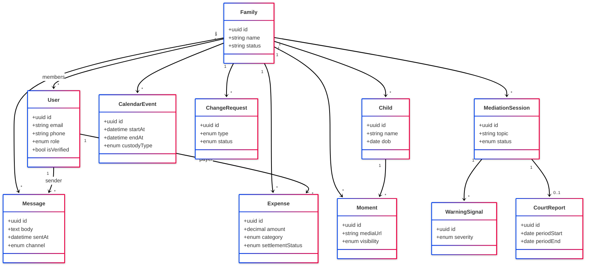
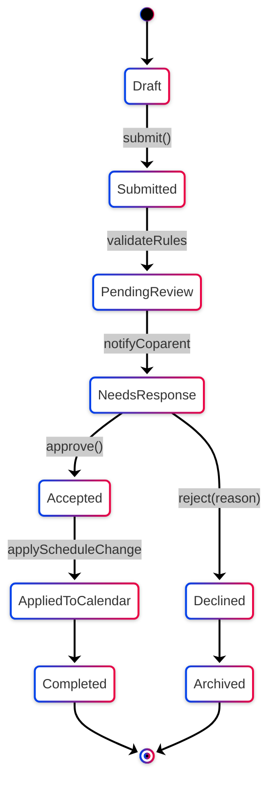
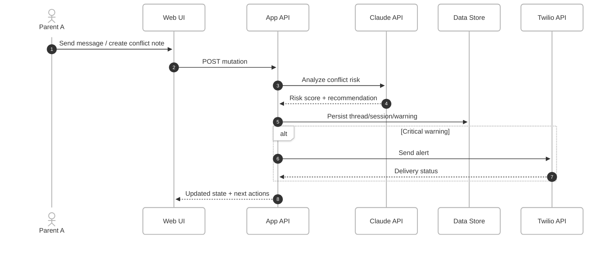
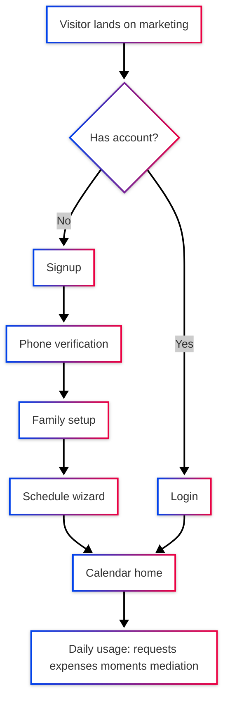
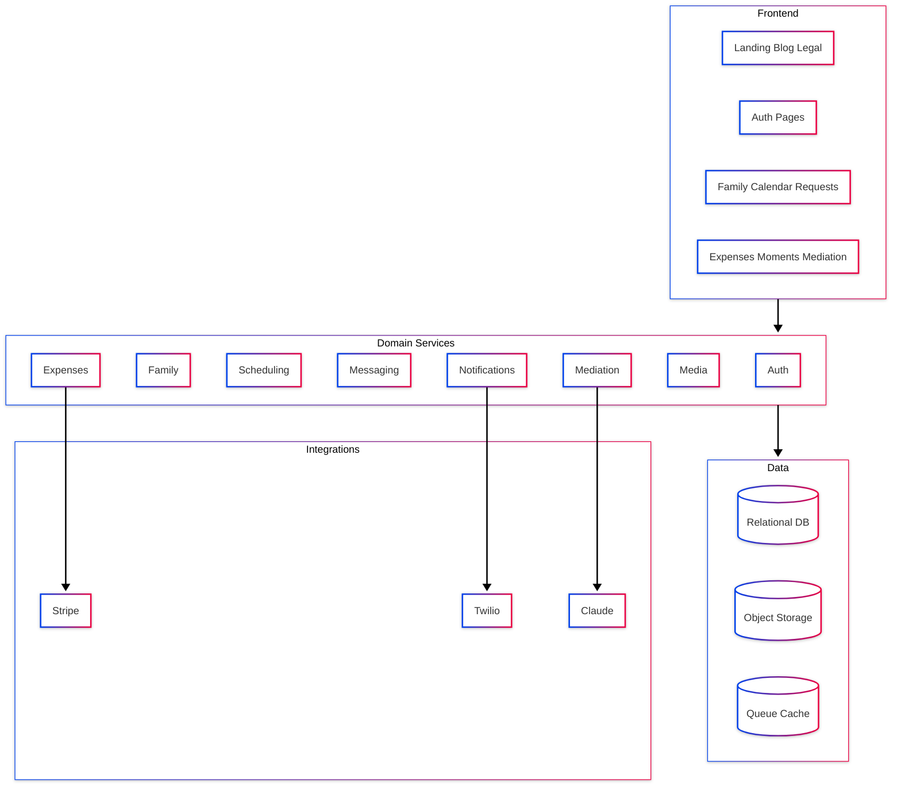
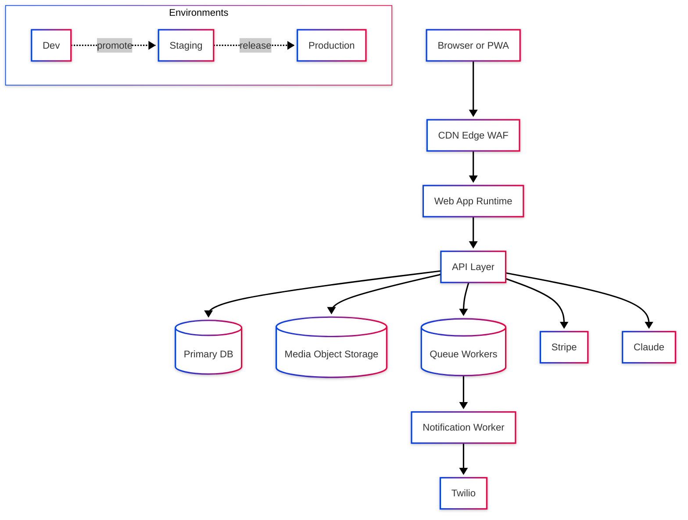

# KidSchedule PRD (Architectural + Functional Specification)

**Author:** Krish Aaron Purmessur Moros   
**Date:** 2026-02-19  
**Version:** 1.2 

This document defines:
- product/business goals,
- functional and non-functional requirements,
- architecture using a 4+1 view model with Mermaid diagrams,
- delivery milestones, KPIs, risks, and evolution path.

It is explicitly mapped to these existing routes/modules:

- Marketing & legal: index, `blog`, `privacy`, `terms`, `pta`
- Auth & account access: `login`, `signup`, `forgot-password`, `messages` (phone verification)
- Core app: `family`, index, `calendar/schedule-wizard`
- Coordination workflows: index, create
- Finance: index, create
- Conflict resolution: index, `mediation/court-report`, `mediation/session/6`
- Family memories: index, create

---

## Purpose and scope

### Business perspective

KidSchedule aims to be the **operational system of record for co-parenting**:
1. reduce coordination conflict,
2. increase schedule reliability,
3. provide documented evidence trails (e.g., mediation and reports),
4. improve retention through daily value loops (calendar, messages, moments, expenses).

### Technical perspective

Build and operate a secure, scalable web platform with:
- strong identity + consent handling,
- family-scoped data isolation,
- resilient workflows across scheduling, communication, expenses, and mediation,
- integration with Stripe, Twilio, and Claude-driven conflict support.

### In-scope

- End-to-end journey from acquisition → onboarding → active co-parenting use.
- Functional coverage for all listed pages and their backend capabilities.
- Analytics and operational observability foundations.

### Out-of-scope (for this PRD cycle)

- Native mobile apps (web/PWA first).
- Multi-tenant enterprise admin panel.
- Full legal advice automation (mediation assist only).

---

## Market assessment & target demographics

### Market snapshot
- Family-tech + co-parenting workflows are underserved, fragmented across calendar, chat, and finance tools.
- Pain point concentration: high-friction communication and accountability gaps.

### Target segments
1. **Separated/divorced co-parents** with shared custody schedules.
2. Families needing **documented, neutral communication records**.
3. Budget-conscious users (free/trial-first), then premium upgrades.

### Positioning
“Calm, transparent co-parenting operations platform” vs generic messaging/calendar apps.

---

## Product overview & use cases

### Core product capabilities
- Shared custody calendar and schedule wizard.
- Change request lifecycle with response tracking.
- Expense entry and split tracking.
- In-app messaging and phone verification.
- Moments (photo sharing with privacy controls).
- Mediation center with AI-assisted conflict handling + court report generation.

### Key use cases
1. Parent proposes schedule change; other parent responds; calendar updates.
2. Parent logs expense and split; co-parent gets notified.
3. Parent uploads a child moment and controls visibility.
4. Communication warning triggers mediation session and summary/report.
5. User signs up, verifies phone, configures family/schedule, becomes active.

---

## Requirements

### Functional requirements

- **FR-01 Auth lifecycle:** signup/login/reset-password/phone verification.
- **FR-02 Family model:** create/manage family unit, members, children.
- **FR-03 Calendar:** view, create, and update custody events.
- **FR-04 Schedule wizard:** guided setup for recurring custody plans.
- **FR-05 Change requests:** create/respond/track status transitions.
- **FR-06 Expenses:** add categorized expenses, split metadata, settlement status.
- **FR-07 Messaging:** send/receive conversation items with verification gating.
- **FR-08 Moments:** upload media, caption, visibility scope, reactions, deletion.
- **FR-09 Mediation:** detect warnings, create sessions, continue threads, escalate.
- **FR-10 Court report:** generate communication climate report by period and filters.
- **FR-11 Notifications:** unread count, feed dropdown, link-out.
- **FR-12 Consent & analytics:** GDPR-aware defaults and event instrumentation.

### Usability requirements

- Mobile-first responsive design for all app pages.
- Max 3 steps for primary actions (e.g., request creation, expense add).
- Clear state labels (pending/resolved/escalated/closed).
- Accessibility baseline: keyboard navigation, semantic forms, color contrast.

### Technical requirements

- Family-scoped authorization on all domain objects.
- CSRF protection on mutating requests.
- Object/media upload validation (type + size).
- Idempotent mutation patterns for retries.
- Auditable event trail for legal-sensitive modules (mediation/reports).

### Environmental requirements

- Web runtime with CDN/edge delivery.
- Separate Dev/Staging/Prod environments.
- Secure secret management and API key rotation.
- Backup/restore strategy for relational and media data.

### Support requirements

- In-product bug report widget with screenshot support.
- Basic support channels and report references.
- Operational runbook for Twilio/Stripe/AI outages.

### Interaction requirements

- Parent-to-parent interactions via requests/messages/moments.
- Parent-to-system interactions: scheduling, expense tracking, verification.
- System-to-external APIs: payments, notifications, AI conflict support.

---

## 4+1 Architectural View Model

### 1) Logical view (class model)

### 1b) Logical state model (change request lifecycle)

### 2) Process view (sequence + activity/communication)

### 3) Development view (package/component)

### 4) Physical view (deployment)

## API integration specification

### Claude
- **Prerequisites:** API key, model entitlement, moderation policy.
- **Available APIs:** message generation, classification/scoring, summarization.
- **Authentication:** bearer token via server-side secret only.
- **Client SDKs:** server SDK preferred; browser direct calls disallowed.

### Stripe
- **Authentication & security:** secret key server-side; signed webhook verification.
- **Make requests:** create customer/subscription/payment intent as needed.
- **Testing & data:** isolated test mode, fixture seeding.
- **Error handling:** idempotency keys, retry with exponential backoff, webhook reconciliation.

### Twilio
- **Make requests:** SMS/verification endpoints through backend proxy.
- **API responses:** normalize status codes and delivery states.
- **Mutations/conflicts:** deduplicate message sends with request IDs.
- **Best practices:** rate limit, template governance, PII-minimized payloads.

---

## Evaluation plan & metrics

### Product KPIs
- Activation: `% users reaching calendar within 24h of signup`.
- Engagement: weekly active families, events created/week, messages/week.
- Coordination quality: request response time, resolution rate, mediation escalation rate.
- Retention: D30 family retention, paid conversion from trial.

### Technical KPIs
- p95 page load and API latency,
- upload success rate,
- notification delivery success,
- error budget burn rate,
- webhook success/reconciliation lag.

### Quality gates
- Security checks on all mutation routes.
- Contract tests for Stripe/Twilio/Claude adapters.
- Accessibility regression checks before release.

---

## Architectural rationale, alternatives, limitations, improvements

### Why this design
- Domain decomposition matches user mental model (family/calendar/expenses/moments/mediation).
- Externalized integrations reduce coupling and improve incident isolation.
- Event + warning flow supports both day-to-day UX and legal/accountability needs.

### Current limitations
- AI mediation guidance can be probabilistic (must keep human control).
- Legal-report semantics vary by jurisdiction.
- Notification reliability depends on third-party uptime.

### Improvement opportunities
- Add policy engine for family-specific rules.
- Introduce workflow orchestration for long-running mediations.
- Expand analytics from event logs to cohort/causal insights.
- Add role-based legal export packages with immutable signatures.
